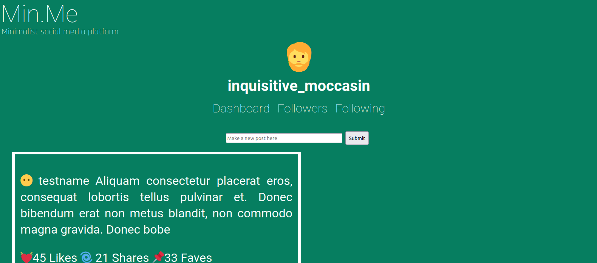

# Min.Me

Minimalist social media app created using React. Created using basic React routing and hooks. Currently filled of static data and access is not completely live



#### How to use

1. Clone repo into desired directory ```git clone https://github.com/Toughee/Min.Me.git``` or ```gh repo clone Toughee/Min.Me```
2. Run ```npm install``` to install all app node modules and dependencies
3. Run ```yarn start``` to run app on http://localhost:3000/

### Future app goals

- [ ] Choosing and changing your set username at any time
- [ ] Settings page for changing app background color, avatar and app UI/UX style
- [ ] "Remove/block" option for followers and following
- [ ] Adding all information to a backend API instead of having all data inserted into inline JS code
- [ ] Add video/gif walkthrough of app use
- [ ] Adding temporary live service for users to try app out

#### Project resources:

[Current roadmap for app](https://github.com/Toughee/Min.Me/projects/1)
[Wiki page for app](https://github.com/Toughee/Min.Me/wiki)
[Documentation for project contributors](https://github.com/Toughee/Min.Me/tree/main/docs)

